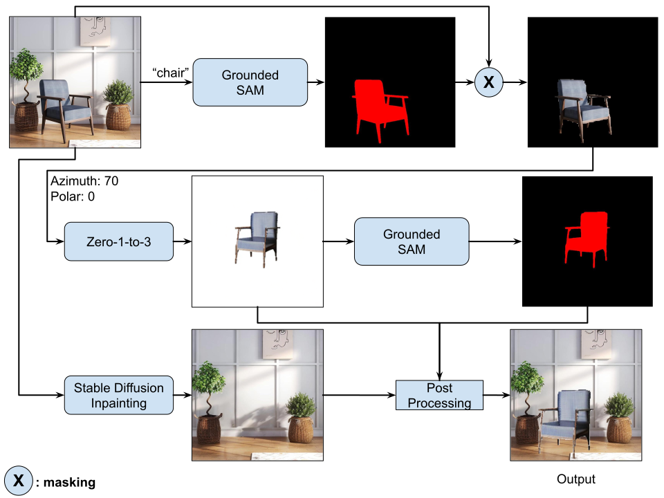

# Pose-Editing

## Pipeline


## Models Used

The following models are integral to the functionality of this project:

- **Grounded SAM**: A model that specializes in semantic segmentation and object grounding, enabling detailed analysis and manipulation of images.
- **Zero 1-to-3**: An innovative model that provides capabilities for 3D object reconstruction and manipulation from single 2D images.
- **Stable Diffusion Inpainting**: Utilized for its state-of-the-art inpainting abilities, allowing for seamless modifications and enhancements to images.

## Installation and Usage

Follow these steps to set up the environment and run the pipeline:

```
pip install -r requirements.txt
```

**Clone the GroundedSAM and Zero123 repositories into the specified directories within this project:**

```
git clone https://github.com/IDEA-Research/Grounded-Segment-Anything.git
git https://github.com/cvlab-columbia/zero123.git
```

Note: 
- After cloning GroundedSAM replace the original ***"grounded_sam_demo.py"*** with ***"files_to_replace/grounded_sam_demo.py"*** from this repository.
- After cloning Zero123 copy the ***"files_to_replace/predict.py"*** to ***"zero123/zero123"*** directory.

**To execute the pipeline**
```
python run.py --image ./path/to/your/image.jpg --class "desired-object-class" --azimuth +72 --polar +0
```

## Report
[View the report (report.pdf)](./Report.pdf)
